<!-- ===================================================== -->
<!-- AI Trip Planner — README.md -->
<!-- Premium • Interactive • Brand-Consistent -->
<!-- ===================================================== -->

<div align="center">


<br/>


<br/><br/>

<a href="#-experience-orchestration"><b>Experience Flow</b></a> •
<a href="#-neural-travel-brain"><b>Neural Brain</b></a> •
<a href="#-cognitive-flow-model"><b>Cognitive Model</b></a> •
<a href="#-planning-system-architecture"><b>Architecture</b></a> •
<a href="#-system-impact"><b>Impact</b></a> •
<a href="#-contact"><b>Contact</b></a>

</div>

---

# 🌍 Experience Orchestration

```mermaid
flowchart LR
    A["✈️ User Intent"] --> B["🧠 Context Interpretation"]
    B --> C["🤖 LLM Planning Core"]
    C --> D["🗺️ Day Structuring"]
    D --> E["✨ Final Itinerary"]
```

<details open>
<summary><b>🧭 From User Intent → Designed Travel Experience (click to collapse)</b></summary>

<br/>



</details>

This system transforms structured constraints into experience logic —  
not just text output.

---

# 🧠 Neural Travel Brain

```mermaid
flowchart TB

    A["🧾 Intent Cortex<br/>Destination • Budget • Duration • Preferences"]:::input
    B["🔎 Context Decoder"]:::process
    C["🌍 Travel Knowledge Layer"]:::memory
    D["🧠 Planning Engine"]:::core
    E["✨ Experience Composer"]:::process
    F["📘 Narrative Output"]:::output

    A --> B
    B --> D
    C --> D
    D --> E
    E --> F

    classDef input fill:#0b1220,stroke:#06b6d4,color:#e5e7eb;
    classDef process fill:#0b1220,stroke:#22c55e,color:#e5e7eb;
    classDef memory fill:#0b1220,stroke:#a78bfa,color:#e5e7eb;
    classDef core fill:#0b1220,stroke:#f59e0b,color:#e5e7eb,stroke-width:2px;
    classDef output fill:#0b1220,stroke:#ef4444,color:#e5e7eb;
```

<details open>
<summary><b>🧬 Cognitive Architecture Map (click to collapse)</b></summary>

<br/>



</details>

This layered cognition separates:

- Understanding  
- Reasoning  
- Structuring  
- Presentation  

Which makes the system scalable and controllable.

---

# 🧠 Cognitive Flow Model

<details open>
<summary><b>🧩 Planning Cognition Ladder (click to collapse)</b></summary>

<br/>

<div align="center">

<table>
<tr>
<td width="20%" align="center">

**Intent Parsing**  
📍 Destination  
💰 Budget  
📅 Duration  
🎯 Preferences  

</td>
<td width="5%" align="center">➡️</td>
<td width="20%" align="center">

**Constraint Modeling**  
Time distribution  
Budget limits  
Travel pacing  

</td>
<td width="5%" align="center">➡️</td>
<td width="20%" align="center">

**Reasoned Planning**  
Activity clustering  
Logical sequencing  
Balanced day design  

</td>
<td width="5%" align="center">➡️</td>
<td width="20%" align="center">

**Experience Composition**  
Readable format  
Narrative clarity  
Human tone  

</td>
</tr>
</table>

</div>

<br/>

The architecture deliberately separates:

- 🧠 reasoning  
- ⏱ sequencing  
- 🖋 formatting  

This prevents chaotic generation  
and enables structured AI planning.

</details>

---

# 🏗 Planning System Architecture

<details open>
<summary><b>⚙️ Layered Structural Boundaries (click to collapse)</b></summary>

<br/>


<br/>

```
Interaction Layer    → Collect user intent
Interpretation Layer → Convert intent into structured reasoning
Intelligence Layer   → Perform AI planning logic
Presentation Layer   → Control narrative clarity
```

Clear boundaries.  
No blurred logic layers.

</details>

---

# 🌟 System Impact

This project demonstrates:

- Structured prompt engineering  
- AI-powered decision systems  
- Controlled itinerary generation  
- Modular reasoning architecture  
- Experience-centered AI output design  

It treats LLMs as cognitive engines inside a defined architecture —  
not free-form generators.

---

# 📬 Contact

<div align="center">

<a href="https://www.linkedin.com/in/navyashree-byregowda-472821196/">

</a>

<a href="https://github.com/Navyagowda2714">

</a>

<a href="mailto:navyashreebyregowda@gmail.com">

</a>

<br/><br/>
<sub>AI Trip Planner — structured intelligence for human travel experiences.</sub>

</div>
